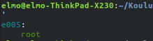
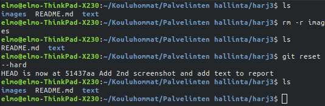
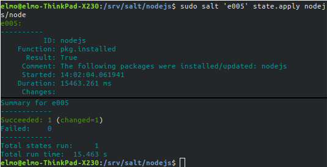
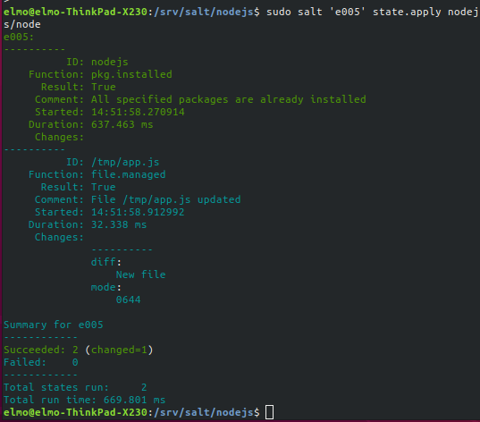

# Harjoitus 3
Tämän harjoituksen tarkoituksena on tutustuttaa itseni Gittiin, sekä GitHubiin ja niiden käyttöön. Harjoitusta varten olen rakentanut uuden 64-bittisen Xubuntu orja-koneen virtuaaliympäristöön, asentanut siihen saltin, sekä yhdistänyt koneen herrakoneeseen.

Ajoin aluksi perinteisen **'whoami'** -komennon herra-koneelta testatakseni yhteyden. Ajan salt-komennot suoraan orja-koneen ID:tä käyttäen.

	master $ sudo salt 'e005' cmd.run 'whoami'

Yhteys toimii!

## "Näytä omalla git-varastollasi esimerkit komennoista 'git log', 'git diff' ja 'git blame'"
Olin tähän mennessä tehnyt GitHubiin itselleni uuden repon ja ladannut sinne tämän raportin, sekä aikaisemman screenshotin 'whoami':n tulosteesta. Tämä oli vaatinut useamman commitin, joten päätin tarkastella lokitulostetta ja printata sen uuteen tiedostoon.

	elmo $ git log > ./text/gitlogprint.txt

Seuraavaksi työnsin lokiraportin GitHubiin ja linkitin sen tähän raporttiin.
	
	elmo $ git add . && git commit

	elmo $ git pull && git push

[Linkki lokiraporttiin.](./gitlogprint.txt)

Lokiraportti näyttää kulloisenkin commitin hashin, ajan, commitin suorittajan, sekä kommentin. Ajoin edellisen lauseen kirjoitettuani komennon

	elmo $ git diff

joka näyttää lisäykset tai poistot committien välillä. Komento tulosti [seuraavanlaisen raportin.](./runninggitdiff.txt) Raportista näkyy, että olin kirjoittanut uuden lauseen tähän tiedostoon ja se siksi erosi aikaisemmasta commitista.

Seuraavaksi kokeilin ajaa komennon

	elmo $ git blame README.md

projektin pääkansiossa. Blame näyttää kysytystä tiedostosta rivi kerrallaan sen, kuka sitä on muokannut, sekä siihen liittyvää informaatiota. [Linkki blamen tulosteeseen.](./runninggitblame.txt)

## "Tee tyhmä muutos gittiin, älä tee commit:tia."

Ja näin tein. poistin git-kansiosta images-kansion kokonaan. Tajuttuani virheeni ajoin pikimiten komennon

	elmo $ git reset --hard

ja sain takaisin images-kansioni, kun Gitin tila palautui edelliseen vaiheeseen.

## "Tee uusi salt-moduli"

Päätin asentaa orja-koneelle nodejs:n Tein modulia varten uuden kansion herra-koneella kohteeseen **/srv/salt**. Loin kansioon sls-tiedoston, joka ajettaessa asentaisi nodejs:n.

	master:/srv/salt/nodejs$ cat node.sls
	nodejs:
	  pkg.installed

Seuraavaksi ajoin tilan aktiiviseksi orja-koneella 'e005' ajamalla komennon

	master $ sudo salt 'e005' state.apply nodejs/node

Salt raportoi nodejs:n asentuneen onnistuneesti orjakoneelle! Seuraavaksi selvitin missä nodejs sijaitsee ja että onko se olemassa ajamalla komennon

	master $ sudo salt 'e005' cmd.run 'which nodejs'

Salt tulosti seuraavanlaisesti:

	e005:
	    /usr/bin/nodejs

Seuraavaksi loin simppelin JS-scriptin "app.js"

	console.log('Hello World!');

ja muokkasin node.sls-tiedostoa niin, että orja-kone vastaanottaisi kyseisen tiedoston.
	
	nodejs:
	  pkg.installed

	/tmp/app.js:
	  file.managed:
	    - source: salt://nodejs/app.js

Ajettuani tilan aktiiviseksi orja-koneelle salt kertoi uuden tiedoston luonnin onnistuneen

